# Як ми модернізували Nomeroff Net за останні 3 роки та що нас чекає в 4-й версії

## Проблеми над якими працювали
Незважаючи на те що в Україні продовжується війна, роботи над проектом Nomeroff Net не припиняються і ми раді представити вам версію 4.0.

Ми вирішити взятись за ряд проблем, по яким вже давно не було прогресу а навіть були погіршення з версії 3.0 до 3.5:

### Детекція багатолінійних номерів.
У попередніх версіях наша стратегія зводилась до детекції зон з надписами, склейка їх у одну строку а  потім розпізнавання OCR-моделлю, яка тренувалась для однолінійних номерах. Це було не дуже гарне рішення, якість розпізнавання багатолінійних номерів була досить посередня.

| Оригінал                                                                                                                                                | Приклади розпізнавання |  
|---------------------------------------------------------------------------------------------------------------------------------------------------------|------------------------|
|     | 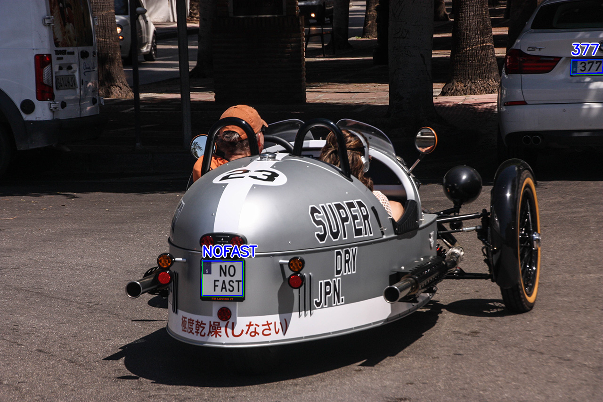 |
| 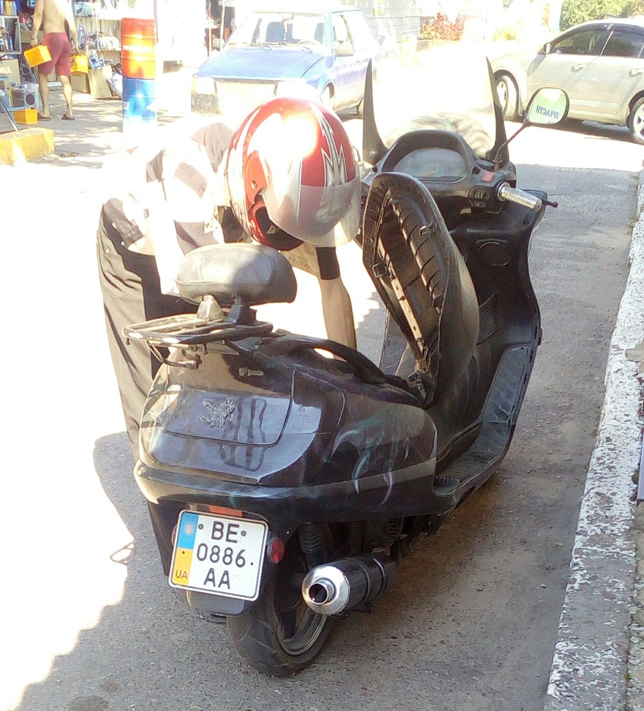                                 | 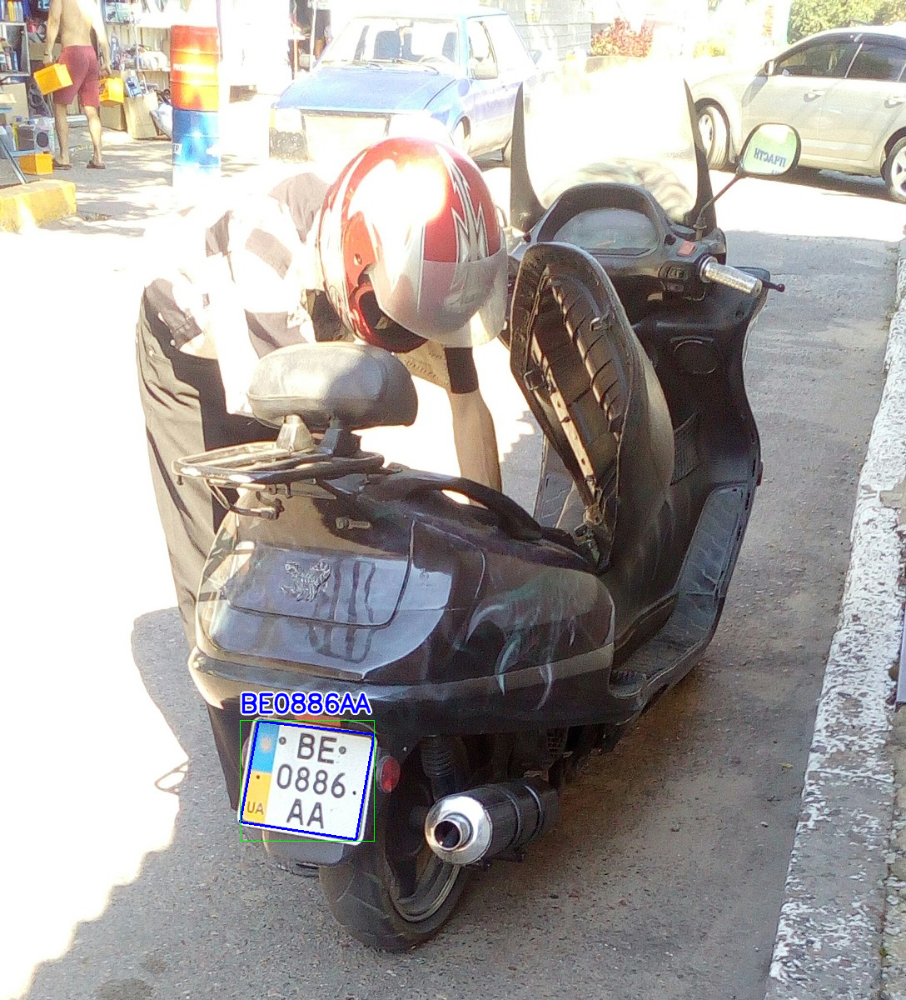 | 
| 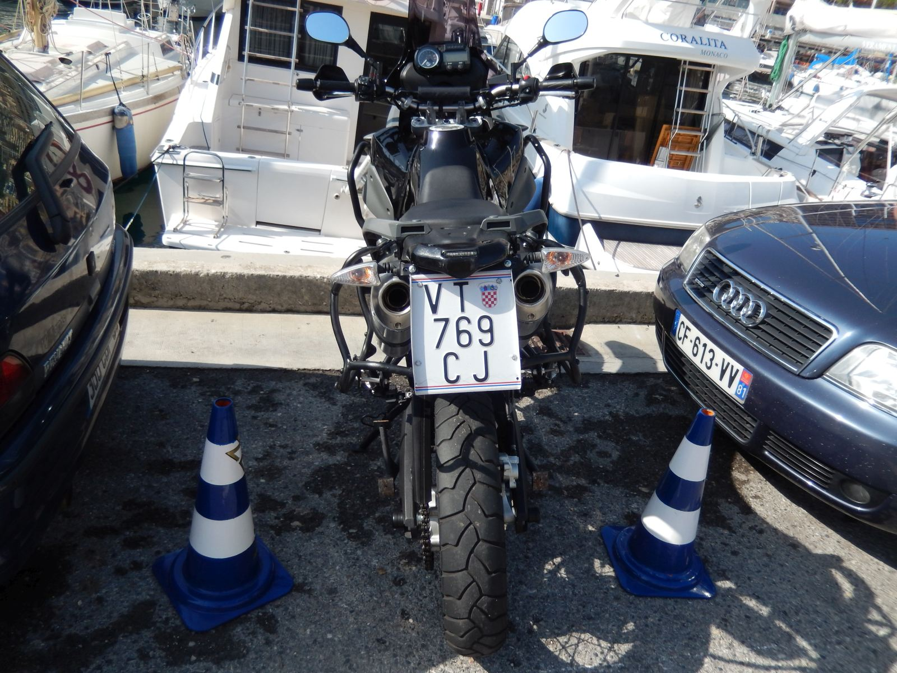                        | 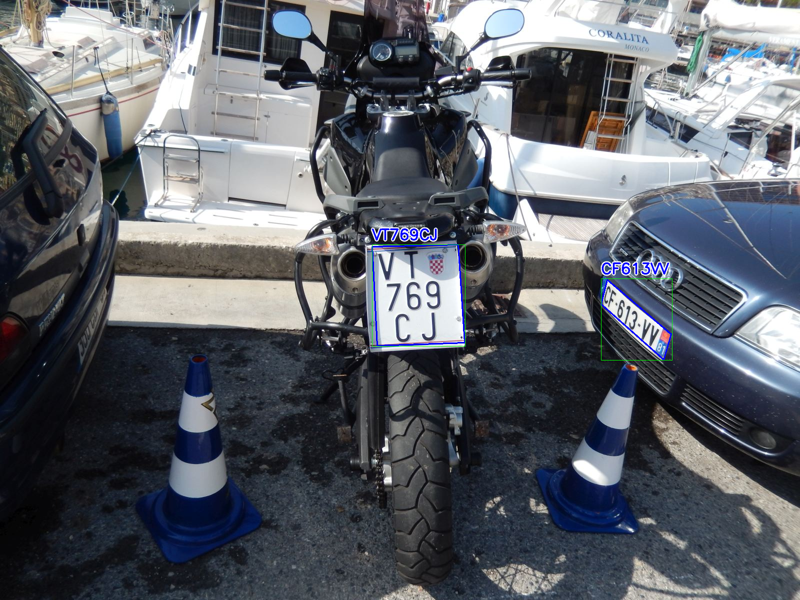 |
|  | 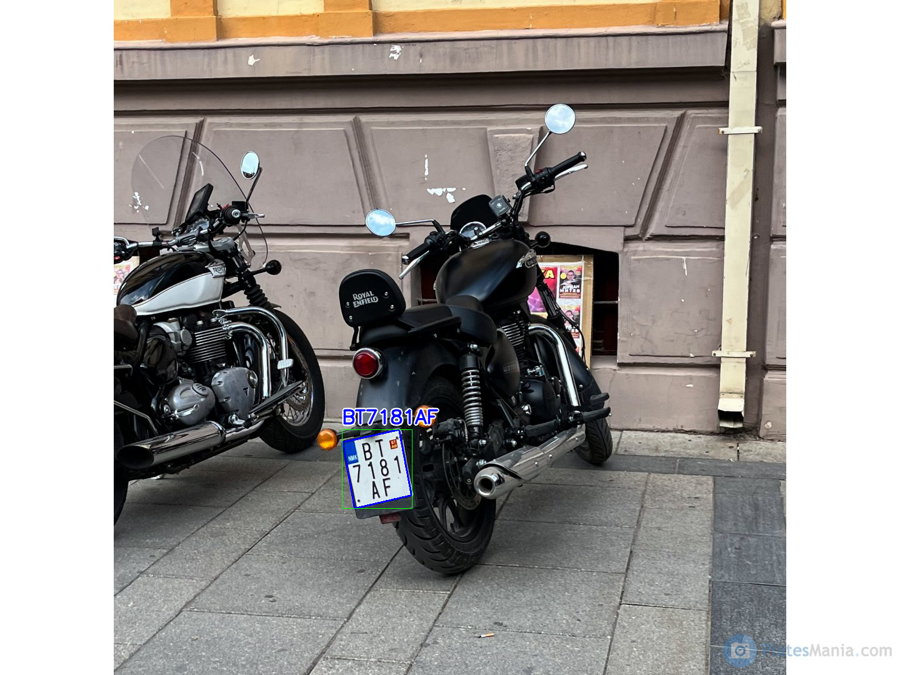 |
| 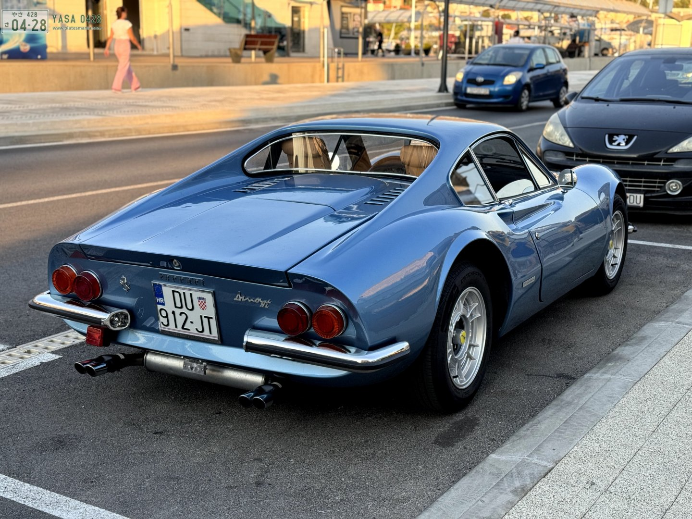            | 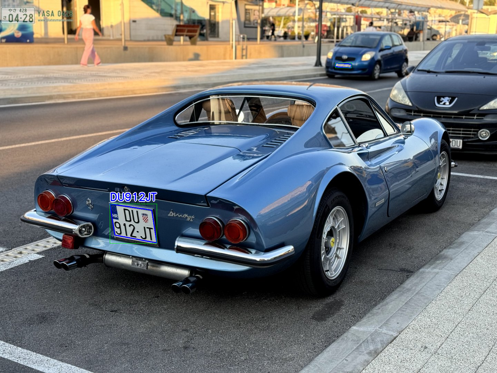 |
|          | 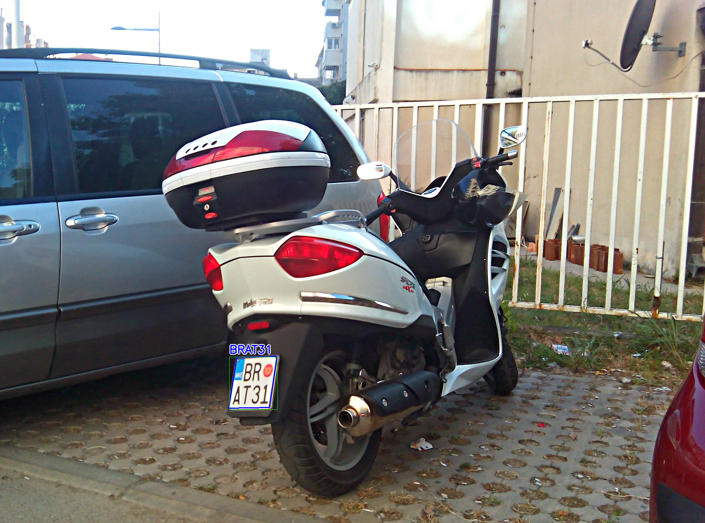 |
| 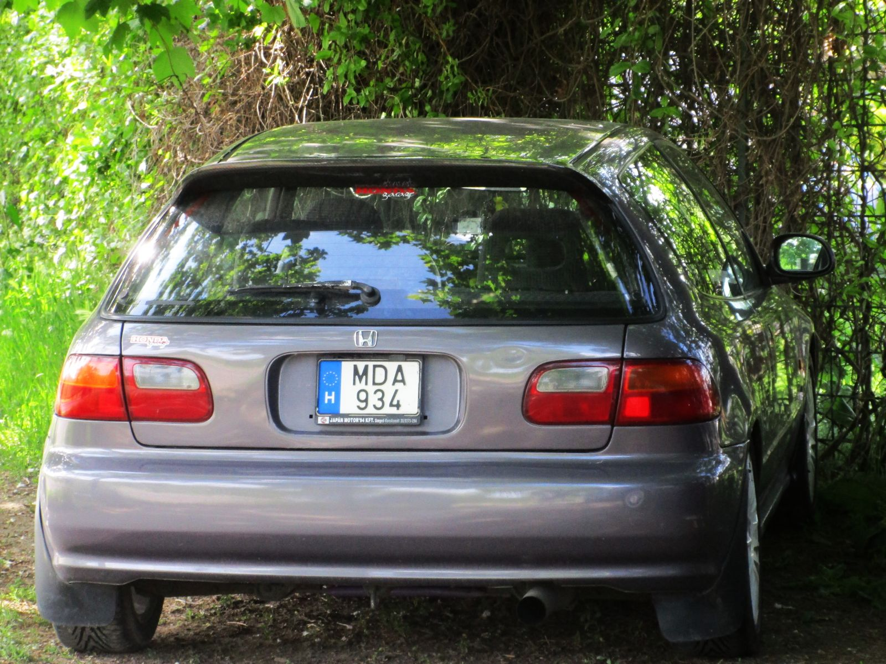                       |  |


У версії 4 ми відмовились від використання загальної моделі для однолінійних та багатолінійних номерів і натренували спеціалізовану Yolo 11 POSE модель яка дозволяє нам якісніше отримувати рамки номерів і виділяти строки з текстом без використання модуля CRAFT. 

### Виникнення memory leak при тривалому використанні nomeroff net у виді сервісу.
Раніше нам приходись періодично (раз на день) перезавантажувати інстанс з запущеним Nomeroff Net, так як він починав поступово збільшував споживання выдео-пам’яті на наших GPU, ми це пов’язуємо з особливостями реалізації модуля CRAFT, який допомагав нам проводити додаткову детекцію ліній з текстом на знайдених баундинг-боксах з номерними знаками. Зараз в цій додатковій детекції немає необхідності то ж ми позбулись викоистання CRAFT.

### Застосування різнотипних OCR.
У попередніх версіях ми намагались створити специфічну OCR для кожної країни, адаптовану до специфіки номерних знаків цієї країни, а також враховували перелік літер, які використовуються у цій країні. (Наприклад, в Українських номерах не використовуються літери Q, W, V та ін). Такий підхід привів до того що в нас появилось дисятки різних OCR, які займають багато місця в пам’яті і Nomeroff Net почав потихеньку перетворюватися на “великого монстра”, який запускається на обмеженому числі комп’ютерів з дорогою GPU.
Зараз ми прийшли до концепції що потрібно використовувати універсальні моделі і робити виправлення на пост-обробці тексту номерного знака.
Для всіх номерів, які записуються латиницею буде одна універсальна модель, для  всіх номерів, які використовують, наприклад, кирилицю буде інша кирилична універсальна модель, теоретично можна натренувати арабську, китайську та ін.
За потреби можна буде лишити спеціалізовану OCR модель або натреновану на своєму датасеті модель (замість універсальної) для заданої країни. Що використивувати вирішувати Вам.
Ось тут можна подивитись приклад налаштування кастомного списку моделей для ваших потреб ( 
https://github.com/ria-com/nomeroff-net/blob/v4.0/tutorials/ju/inference/get-started-demo-ocr-custom.ipynb ), список моделей “по-замовчуванню” можна подивитись у цьому фрагменті коді, вони задані у змінній DEFAULT_PRESETS
https://github.com/ria-com/nomeroff-net/blob/e03d093e15bb62eea0a36ef1aaa25bd1b31e41d2/nomeroff_net/pipelines/number_plate_text_reading.py 

Перелік доступних моделей можна подивитись у цьому фрагменті коду, перелік доступних моделей заноситься у змінну model_config_urls (моделі з OCR помічені коментарем #OCR):
https://github.com/ria-com/nomeroff-net/blob/v4.0/nomeroff_net/tools/mcm.py 

### Низька роздільна здатність номера що розпізнається
Є випадки коли камера знаходиться на великій відстані від об’єкту розпізнвання або фото на якому йде пошук номера має низьку роздільну здатність в версії 4.0 з’явилась можливість зробити upscale зоні з номерним знаком, яка буде в подальшому прочитана OCR-моделлю. Це може покращити результат розпізнавання але буде потребувати додаткових ресурсів на застосування моделей [HUT або DRCT](https://github.com/ria-com/upscaler.git).

| Фрагмент фото перед розпізнаванням                                                                                                           | Збільшений у 4 раза фрагмент за допомогою моделі HAT-L_SRx4_ImageNet-pretrain                                                                                       |
|----------------------------------------------------------------------------------------------------------------------------------------------|---------------------------------------------------------------------------------------------------------------------------------------------------------------------|
| 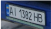 | 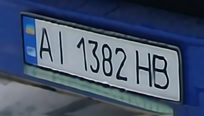 |
| 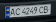  | 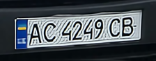 |
| 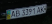  | 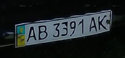 |

### Швидкість детекції

У версії Nomeroff Net 4.0 ми використали нову модель YOLO v11, яка є швидшою і точнішою за попередню YOLO v8, також ми працюємо над спрощеними моделями, які можна застосувати при обмежених ресурсах.
Зазвичай, для максимальної якості знаходження ми використовуємо yolo11x-pose але можна підключити і yolo11n-pose яка буде теж давати непоганий результат. Аналогічні спрошення, згодом, будуть розроблятись і для OCR-моделей.

### Пpоста установка через PIP
Модуль 4-ї версії легко встановити за допомогою pip:

```pip install nomeroff-net```

## Які результати одержали
Також завдяки виключенню з проекту використання модуля CRAFT інференс моделей став приблизно на 9% швидший за попередню версію. В середньому швидкість детекції складає біля 100 ms (ця цифра може суттєво мінятись з залежності від розміру фото для обробки, GPU на якому відбувається розпізнавання, швидкості роботи мережі, жорсткого диску системи та багато інших факторів)


## Nomeroff Net як сервіс
Якщо Ви зацікавлені у використанні модуля розпізнавання номерних знаків або розпізнавання VIN-коду у виді сервісу то з виходом оновленої версії з’явилась така можливість. 
Ми почали надавати доступ нашим клієнтам через API до [комерційних ML-сервісів RIA.com](https://ai.ria.com). 
Прямо зараз можна скористатись сервісом:
  * [Numplate RIAder](https://ai.ria.com/ua/numplate-riader) - Система ALPR/ANPR для розпізнавання номерних знаків
  * [VIN RIAder](https://ai.ria.com/ua/vin-riader) -  Система розпізнавання VIN-кодів


